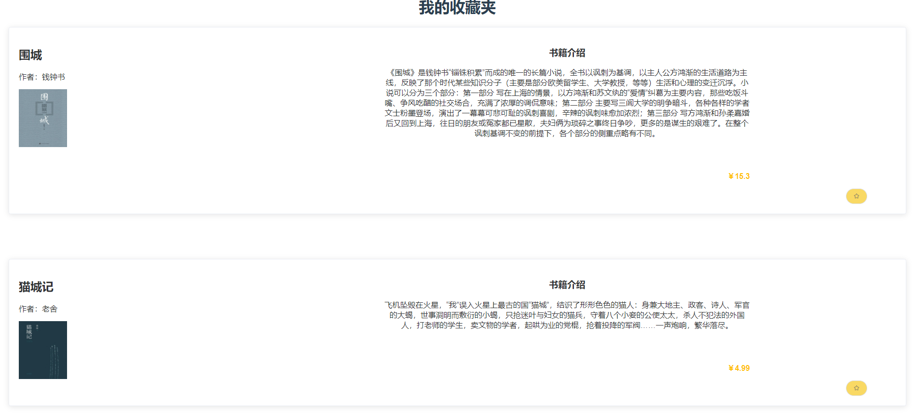

# BookStore

## 网上书城前台部分

### 预览图

1-1 商城主页

获取书籍信息并分页显示

1-2 收藏夹页面

读取用户收藏夹并显示
 
1-3 欢迎页

1-4 登录页

1-5 注册页

## 网上书城后台管理部分

### 预览图

1-1 书籍管理页面

普通管理员实现书籍增删改查

1-2 信息录入页面

录入书籍信息及书籍封面

1-3 用户管理页面

超级管理员实现用户增删改查

1-4 角色管理

超级管理员实现角色增删查以及管理对应角色的菜单权限

1-5 菜单管理

超级管理员实现页面菜单的增删改查

## 使用技术

### 前端
* Vue: 渐进式JavaScript 框架。
* element-ui: 基于 Vue 2.0 的桌面端组件库。
* axios：基于promise网络请求库，作用于node.js和浏览器中。

### 后端
* Springboot框架
* JWT：为了在网络应用环境间传递声明而执行的一种基于JSON的开放标准，一般被用来在身份提供者和服务提供者间传递被认证的用户身份信息，以便于从资源服务器获取资源。
* Lombok：一个Java库，它会自动插入编辑器和构建工具中，Lombok提供了一组有用的注释，用来消除Java类中的大量样板代码。
* MyBatis：基于Java的持久层框架。
* Mybatis-plus：MyBatis (opens new window)的增强工具。
